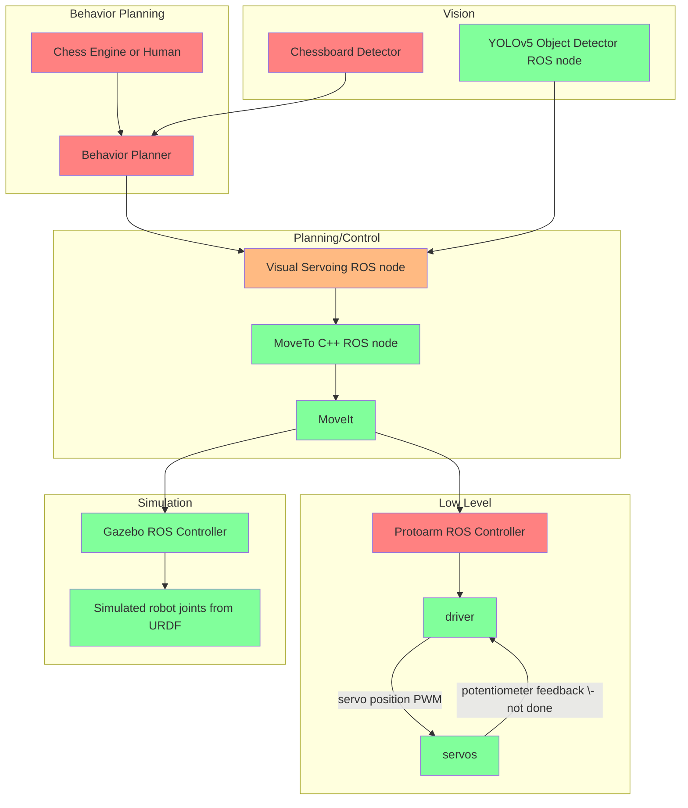
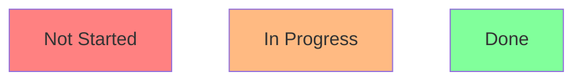
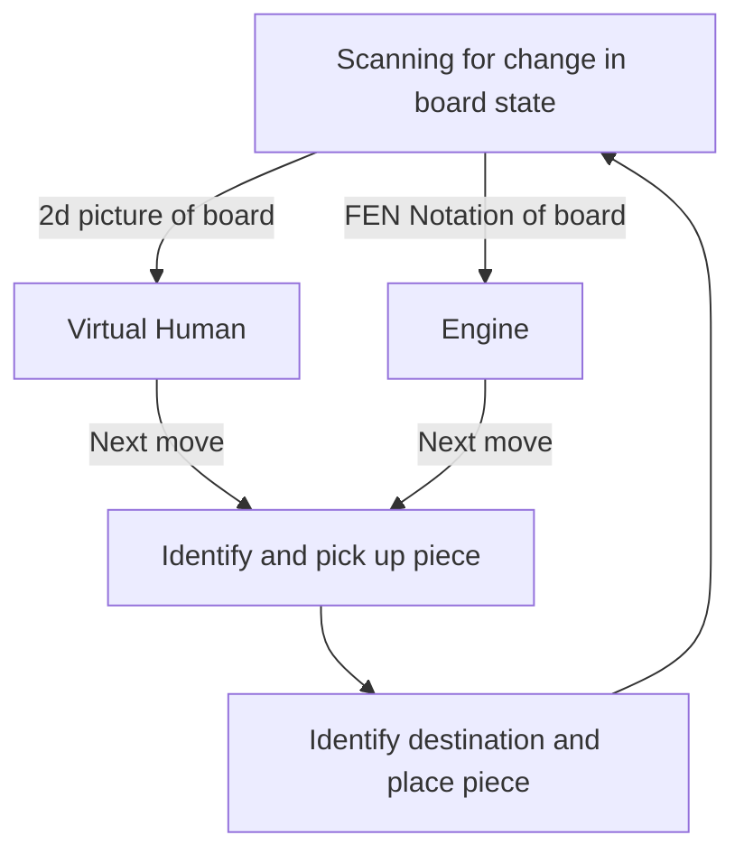
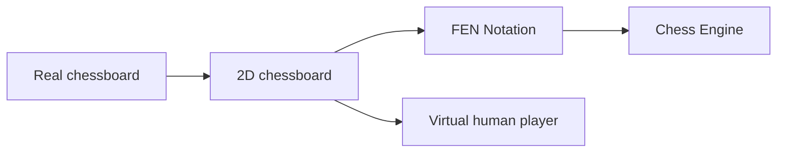

> If you want to look at code and run some of it, check out [arc_robot_arm](https://github.com/purdue-arc/arc_robot_arm) README for quick start details and usage instructions.

## How to use this if you're new

From the diagram and subsection descriptions, you can hopefully get a preliminary high-level understanding of each of the parts and how they fit together. 

From this, you can then:

1. Choose which subsection interests you most 
2. Follow links in the specified subsection to get more contextual understanding (Optionally ask questions in the Discord, hop in a voice chat, etc for more fun convo about the area)
3. Ensure you understand the related topics for each subsections with practical understanding/experience by completing a step-by-step tutorial (either use google to find one or ask for suggestions in Discord), ensuring that it uses the related topics (**Can be done concurrently with #2**)
4. At this point, you should have enough knowledge/experience in your subsection to contribute to the current approach and possibly even change what the current approach is if you find better ways to do things (if so, update these docs!) 

## System Overview

## High level

### Behavior Planner
After the robot turns on or at any given point of time, what should the robot do? This is the job of the behavior planner. 

Overall, it should output executable commands that return true or false if they are completed successfully and then output the next command. A preliminary decision flowchart that a robot can make is modeled here:

To implement the behavior planner, a Finite State Machine (FSM) and/or a Behavior Tree (BT) can be used, which both have tradeoffs in **modularity** and **reactivity**, ([read more](https://roboticseabass.com/2021/05/08/introduction-to-behavior-trees/), scroll to the last section for ).

**Related Topics:**
- [ROS](https://wiki.purduearc.com/wiki/robot-arm/software#ros)
- [Python](https://wiki.purduearc.com/wiki/robot-arm/software#pythonnumpy)
- [FSM](https://wiki.purduearc.com/wiki/robot-arm/software#fsm) and/or [BT](https://wiki.purduearc.com/wiki/robot-arm/software#behavior-trees)

## Vision 

### Chess Piece Detection
How does our robot determine which piece is which and where is that piece relative to the arm? This is a common scenario in many real-world use cases and object detection, as the name suggests, is used to detect the chess pieces.

The object detection stack consists of the [YOLOv5](https://github.com/ultralytics/yolov5) object detection model trained on a custom dataset and outputs 2d bounding boxes. This can then be extrapolated to 3D coordinates from the camera intrinsics relative to the arm with some coordinate transformations from camera -> robot arm base. 

For chess, the model is trained with a custom large chess piece dataset of 500+ images stored on [roboflow](https://app.roboflow.com/). [Here](https://colab.research.google.com/drive/1XJ82eVA0cEfTczXFMtV1sunqvsfiJWQ0?usp=sharing) is a simple colab that walks through the training process using a Roboflow dataset.

Inference is using the `yolov5_pytorch_ros` ROS package using the `detector` ROS node using Python/PyTorch, allowing it to communicate detections and classes to other nodes such as for visual servoing. It reaches around 15-20 FPS without a GPU on a Mac.

> See [chess_piece_detector](https://github.com/purdue-arc/arc_robot_arm/tree/main/chess_piece_detector) for quick start details and usage instructions.

**Related Topics:**
- [ROS](https://wiki.purduearc.com/wiki/robot-arm/software#ros)
- [Python](https://wiki.purduearc.com/wiki/robot-arm/software#pythonnumpy)
- [Object Detection using YOLOv5](https://wiki.purduearc.com/wiki/robot-arm/software#object-detection)
- [Coordinate Transformations](https://wiki.purduearc.com/wiki/robot-arm/software#coordinate-transforms)

### Chessboard Detection
Playing chess is more than just picking and placing pieces. The robot needs to actually beat the human. We need to know the exact state of the chessboard, so another person or an overpowered engine can say what move to play next.

We can do this using a computer vision techniques with an image of the current chessboard as an input and the FEN notation of to board as an output. The following diagram shows this visually:

Some external projects we plan to use to complete the above:
- [Real chessboard -> 2D chessboard](https://github.com/maciejczyzewski/neural-chessboard)
- [2D chessboard -> FEN Notation](https://github.com/Elucidation/tensorflow_chessbot)

**Related Topics:**
- [ROS](https://wiki.purduearc.com/wiki/robot-arm/software#ros)
- [Python](https://wiki.purduearc.com/wiki/robot-arm/software#pythonnumpy)
- [Machine Learning](https://wiki.purduearc.com/wiki/robot-arm/software#machine-learning)

## Control

### Visual Servoing
Even if we can see where the pieces are with the camera, how does the robot arm move closer to the chess piece it wants to pick up? Without visual servoing, any error that the robot makes cannot be accounted for and adjusted for accordingly, resulting in lots of fails. Visual servoing is a control algorithm using images as input to control for any errors that the robot makes.

We are using image-based visual servoing to localize the robot arm hand over an object in a graspable configuration, using images/2d bounding boxes as inputs to the system and servo commands as outputs.

> Visual servoing system diagram ([source](https://www.researchgate.net/figure/Visual-servoing-closed-loop_fig1_265436696))

See the `protoarm_visual_servoing` package for more details.

**Related Topics:**
- [ROS](https://wiki.purduearc.com/wiki/robot-arm/software#ros)
- [Python](https://wiki.purduearc.com/wiki/robot-arm/software#pythonnumpy)
- [Visual Servoing](https://wiki.purduearc.com/wiki/robot-arm/software#visual-servoing-1)
- Usage of the MoveTo node
- [Coordinate Transforms](https://wiki.purduearc.com/wiki/robot-arm/software#coordinate-transforms)
- [Robot Arm Kinematics](https://wiki.purduearc.com/wiki/robot-arm/software#robot-arm-kinematics)

### Kinematics and Planning 

As a human, it is simple to move our joints and pick something up in 3D space. For a robot arm, it knows nothing of 3D space, only numerical angles for each of its joints. So, we use [inverse kinematics](https://en.wikipedia.org/wiki/Inverse_kinematics) (IK), the mathematical process of converting 3D space coordinates to joint angles, to determine the final position for the robot arm. 

Now what happens between the start and final position? That's the job of the motion planner. It determines a safe collision-free trajectory for each joint and creates the plan. Then, the plan is executed, either in real life or in simulation. 

As of now, all the kinematics and planning heavy lifting is done by [MoveIt](http://moveit.ros.org/). The `protoarm_kinematics` package houses a wrapper written in C++ that abstracts the process of sending [JointState](http://docs.ros.org/en/melodic/api/sensor_msgs/html/msg/JointState.html) or [Pose](http://docs.ros.org/en/noetic/api/geometry_msgs/html/msg/Pose.html) goals. 

The wrapper is interfaced externally using the `move_to` node. Refer to the [test_kinematics](https://github.com/purdue-arc/arc_robot_arm/blob/main/protoarm_kinematics/src/test_kinematics) rospy file in `protoarm_kinematics/src` for usage of the `move_to` node. 

This package is also where we would keep our custom kinematics plugin and planning library if we choose to make it from scratch, instead of the default [KDL](https://ros-planning.github.io/moveit_tutorials/doc/kinematics_configuration/kinematics_configuration_tutorial.html#the-kdl-kinematics-plugin) kinematics plugin and [OMPL](https://ros-planning.github.io/moveit_tutorials/doc/ompl_interface/ompl_interface_tutorial.html) motion planning library. 

> See [protoarm_kinematics](https://github.com/purdue-arc/arc_robot_arm/tree/main/protoarm_kinematics) for quick start details and usage instructions.

**Related Topics:**
- [ROS](https://wiki.purduearc.com/wiki/robot-arm/software#ros)
- [Python](https://wiki.purduearc.com/wiki/robot-arm/software#pythonnumpy)
- [MoveIt](https://wiki.purduearc.com/wiki/robot-arm/software#moveit)
- [Coordinate Transforms](https://wiki.purduearc.com/wiki/robot-arm/software#coordinate-transforms)
- [Robot Arm Kinematics](https://wiki.purduearc.com/wiki/robot-arm/software#robot-arm-kinematics)

## Low level

### Controller 
`protoarm_control` is the ROS package that ensures that MoveIt execution commands are executed exactly as expected and to a degree of certainty in the real world. 

Right now, the driver communicates directly with MoveIt as the `protoarm_control` package doesn't exist yet and because we do not have servo feedback.

Given that the protoarm uses some of the cheapest servos on the market, how can we still get dependable sub-millimeter precision to do tasks reliably? One way to do so is to hack our servos to add encoders, and use a control scheme that can take velocity and torque into account.

Inspired by Adam's [Servo Project](https://github.com/adamb314/ServoProject).

**Related Topics:**
- [ROS](https://wiki.purduearc.com/wiki/robot-arm/software#ros)
- [Python](https://wiki.purduearc.com/wiki/robot-arm/software#pythonnumpy)
- [Cascade-style Control](https://wiki.purduearc.com/wiki/robot-arm/software#cascade-style-control)
- [Encoders](https://wiki.purduearc.com/wiki/robot-arm/software#encoders)

### Driver
The `protoarm_driver` is written in Arduino that actually interfaces with the servos and encoders. It sets joint limits, does coordinate frame conversions from the URDF to the actual robot, converts MoveIt angles to servo joint angles $$(-\pi,\pi)$$ to $$(0^\circ,180^\circ)$$, and executes servo commands using PWM to the servos.

**Related Topics:**
- [Arduino](https://wiki.purduearc.com/wiki/robot-arm/software#arduino)

## Simulation

### Gazebo

There are lots of benefits from simulation spanning from speeding up development and testing of software, realistic environments for reinforcement learning, and testing proof of concepts. 

Our arm is simulated in Gazebo with a Realsense D435 camera (`realsense_ros_gazebo`), chessboard, and chess pieces (`chessboard_gazebo`). The robot arm and the camera are represented in [URDF](http://wiki.ros.org/urdf/XML/model). 

Sensors, actuation, gazebo plugins, and more are [specifications](http://wiki.ros.org/urdf/XML) that can be added. For the arm, these specifications exist in the `.xacro` files in the `urdf` folder of the `protoarm_description` ROS package.

Gazebo uses SDF models (in `models` folder of `chessboard_gazebo`) to represent static assets in the simulation like the chess pieces and chessboard. These objects are then spawned into a Gazebo world (along with the robot URDF), represented with a `.world` file.

> See [protoarm_bringup](https://github.com/purdue-arc/arc_robot_arm/tree/main/protoarm_bringup) for quick start details and usage instructions.



**Related Topics:**
- [Gazebo](https://wiki.purduearc.com/wiki/robot-arm/software#gazebo-1)
- [URDF]()

# Resources

## Tools

### ROS  

- [ARC ROS tutorials (Recommended)](https://wiki.purduearc.com/wiki/tutorials/snake-tutorial)
- [Official ROS tutorials](http://wiki.ros.org/ROS/Tutorials)

### GitHub
- [Learn Git under 10 min](https://www.freecodecamp.org/news/learn-the-basics-of-git-in-under-10-minutes-da548267cc91/)

### C++
- [In depth tutorial playlist for C++](https://www.youtube.com/watch?v=18c3MTX0PK0&list=PLlrATfBNZ98dudnM48yfGUldqGD0S4FFb) 
  - Recommended topics:
    - if/else, loops, functions, classes
    - Pointers/References
    - Smart pointers
    - Dynamic Arrays (std::vector) 
- Very useful numeric libraries
  - [Eigen](https://eigen.tuxfamily.org/index.php?title=Main_Page): Extremely efficient matrix math library

### Python/Numpy

**Python**

- [Tutorial](https://www.youtube.com/watch?v=rfscVS0vtbw)
- Important topics to understand: 
  - Basics are good - variables + logic, functions, classes

**Numpy** 
> Must use when working with large arrays (i.e images)

- [Tutorial](https://www.youtube.com/watch?v=8Y0qQEh7dJg) 
- Important topics to understand: 
  - Creating arrays
  - slicing + indexing
  - reshaping
  - linear algebra

**OpenCV**: 
> Use for computer vision and image transformations like color detection, tracking, etc

- [Tutorial](https://www.youtube.com/watch?v=oXlwWbU8l2o) 
- Important topics to understand: 
  - image transformation
  - thresholding
  - read/write images from file
  - resizing
  - tracking

### Arduino
- Top hit for "arduino tutorial" on google should work

### Gazebo
- Important topics (Googlable)
  - Creating a world
  - Adding assets
  - ROS control in Gazebo
  - Cameras in Gazebo

### Good coding practices
- [Optimized C++ code](https://cpp-optimizations.netlify.app/)

TODO

## Algorithms, Theory, Math 

### Coordinate Transforms 
- [Understanding the pose of a robot](http://faculty.salina.k-state.edu/tim/robotics_sg/Pose/Pose.html)

### FSMs 
- [tutorial slideshow](https://www.clear.rice.edu/engi128/Handouts/Lec17-Robotics.pdf)

### Behavior Trees 
- [intro to behavior trees](https://roboticseabass.com/2021/05/08/introduction-to-behavior-trees/)

### Control Algorithms 

#### PID Controller 
- [tutorial](https://ctms.engin.umich.edu/CTMS/index.php?example=Introduction&section=ControlPID)

#### Cascade Controller
- [Implememtation by Adam for Servo Project](https://github.com/adamb314/ServoProject)

### AI 

#### Object Detection 
- [train yolov5 model on custom dataset](https://blog.roboflow.com/how-to-train-yolov5-on-a-custom-dataset/)

#### Machine Learning 

## Sensor related 

### Camera
- [Camera driver ROS package]()
- [Camera calibration ROS package]()

### Encoders 
- [Arduino Encoder Package](https://www.arduino.cc/reference/en/libraries/encoder/)