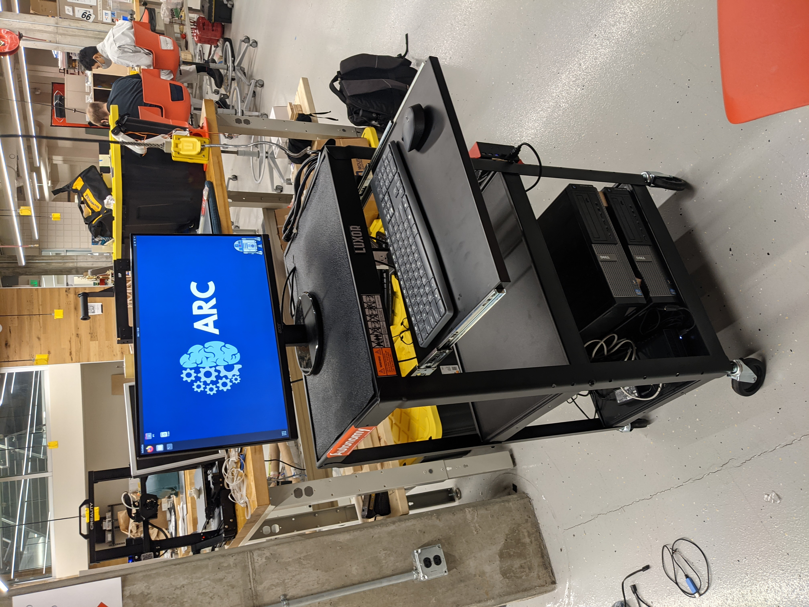

## Goal

Build a system of autonomous, scaled vehicles to play head-to-head in a game of high-speed soccer. Inspiration draws from the game, Rocket League, in which rocket-powered vehicles play soccer in 3v3 matches.

Current tasks are aimed at creating an interactive demo, where a team of human controlled cars compete against a team of autonomous cars. Future work may entail using the working system to launch a multi-university competition. Teams would build their own autonomous strategies and face-off in a tournament bracket.

## System Overview

Our system is organized into several components, which function together to create an autonomous Rocket League car.

The system consists of several specialized layers, which each reduce abstraction as information flows from the top of the diagram to the bottom. For example, a control effort (ex: put the steering wheel at 10 degrees) is less abstract than a collision goal (ex: hit the ball at position (3,5) cm in the (1,0) direction). Each layer refines the previous command until it is eventually something usable by the car's hardware.

Each layer also utilizes feedback in order to correct errors. For example, the velocity controller may notice the car's velocity is too fast, and then step slightly off the throttle to correct. Each layer uses a common perception system as a truth to compare against.

For more information on each layer / subsystem, see the below sections to learn more about its input and output, and how it processes it (including the software and languages in use).

### Intercommunication

Like most ARC projects, Rocket League uses [ROS](https://www.ros.org/about-ros/) to handle communication between each component. ROS is compatible with the Python, C++, and Arduino used on the project.

> Documentation on setting up and learning about your ROS development evironment can be found [here](/wiki/tutorials/ros).

<!--
This is way too high level for an overview, but it should eventually go on a different page

The following was created Spring '21 to detail our ROS network:
 -->

### High Level Planner / Reinforcement Learning

This component uses deep reinforcement learning in order to develop strategies for playing Rocket League. It is still being prototyped in Python, using PyTorch and Keras (Tensorflow). When complete, it will recieve the full state of the game, and output a collision goal (where, when, and in what direction to hit the ball) to the Mid Level Software stack.

Rocket League High-Level Planner Update:
Our team has made significant progress in developing the High-Level Planner for the Rocket League project using deep reinforcement learning to generate game strategies. The current prototype is built in Python using Stable Baselines 3, an OpenAI deep learning library built on PyTorch and Keras (Tensorflow). It will ultimately provide instructions to the car, such as acceleration and steering direction, via radio communication.

From Fall 2021 till Spring 2023, we accomplished the following:
	•	Created an initial training script that enables the training of multiple simulators in parallel for efficient performance. It uses a vectorized simulator environment, and creates a Proximal Policy Optimization model with the Stable Baselines 3 library.
	•	Developed a hyperparameter tuning script that tests different combinations of network hyperparameters to find the most effective ones.
	•	Created a multi-processing script that enables the simultaneous training of multiple models with different reward and environment variables.
	•	Successfully trained a model to consistently score goals in one goal, overcoming issues such as riding against walls, excessive turning, and imprecise turns.
	
For future work, we plan to explore alternative models to PPO and train one agent to compete against another agent. We will also work on training the agent to perform well with noisy data.

It utilizes a simulator for training, which is described below.

#### Simulator

This component exists for training the High Level Planner, and testing / debugging Mid Level Software. It is written in Python, using the Box2D physics engine, and must realistically simulate all physical elements of the game. It can be used to replace everything below Mid Level Software (including the Velocity Controller and Perception) if the entire game is to be run in simulation.

### Mid Level Sotware

Together, the Trajectory Planner and Waypoint Controller (both implemented in Python) recieve a collision goal and are responsible for guiding the car to acheive the goal by outputting instantaneous velocity commands for the car.

#### Trajectory Planner

This component considers the car's current location and velocity, and the collision goal, to generate a trajectory for the car to follow. It can operate in several modes to generate trajectories via different mathematical functions, and has many many many configurable settings.

#### Waypoint Controller

This component is what enables the car to follow the generated trajectories. It commands the car to follow specific velocities and wheel angles by applying the [pure pursuit algorithm](https://www.mathworks.com/help/robotics/ug/pure-pursuit-controller.html#:~:text=Pure%20pursuit%20is%20a%20path,in%20front%20of%20the%20robot.&text=You%20can%20think%20of%20this,point%20in%20front%20of%20it.) on the path given by the trajectory planner.

### Velocity Controller

This component (also called the low-level controller) adjusts the control efforts (specific throttle and steering values) such that the velocity and heading of the car matches the desired setpoint from the waypoint controller. It implements a PID controller, and is currently written in Python. Future work may see it ported to a different language, such as C++ or MATLAB.

### Hardware Inferface

This component allows communication to occur between the ROS network and the RC car.

Control efforts to the car are broadcasted using a FrSky XJT transmitter. These messages are encoded by an Arduino script running on a Teensy 3.1, which communicates to the radio using a digital PPM signal. ROS Serial is used to send the desired efforts to be encoded to the Teensy from the ROS network.

An image of the hardware for one car is shown below:

### Car

The car is the complete physical system of one player on the field. Tests were performed on off-the-shelf cars, however none met the desired criteria for acceleration and control. To solve this issue, the team upgraded the electronics of the best-tested car and found much increased performance.



> Left: upgraded car, middle & right: stock cars

The car's upgrades replaced the servo motors, receiver, speed controller, and battery.

> Documentation will be created in the Fall 2021 semester to have step-by-step upgrade instructions to build a matching car

<!--
TODO: include more info on car's specific upgrades
TODO: include picture of car's upgrades
-->

### Environment

Work has been done towards creating a consistent environment for operating the cars and providing infrastructure for localization.

In Spring 2021, physical tests were performed on Krach's carpet and used plywood planks to provide boundaries. Tripods with PVC tubes were also used to hold multiple cameras necessary for localization.

Future work intends on using aluminum square tubing to rigidly mount cameras with the addition of 3D printed mounts.

### Perception

The perception system is responsible for tracking odometry (position, orientation, linear velocity, and angular velocity) for each car and the position and velocity of the ball.

In the prototype system, cars are tracked through [AprilTags](https://april.eecs.umich.edu/software/apriltag#:~:text=AprilTag%20is%20a%20visual%20fiducial,tags%20relative%20to%20the%20camera.) and the ball through OpenCV color thresholding techniques. ARC uses C++ for both systems.

In order to capture the size of the operating field, multiple cameras are required. The current system uses two PointGrey (FLIR) cameras and two Basler cameras.

Processing AprilTags for each camera is computationally expensive, so the team invested in a "Computation Cart" with two desktop PCs. Each PC is responsible for two cameras.

Information from each desktop is then communicated over the ROS network:

## Future work

The team has outlined the following objectives in working towards the overall goal:

- Proving the high-level framework on snake game
- Testing and tuning of simulator for usage in training high-level planner
- Completion of camera mounting infrastructure
- Completion of field manufacturing
- Perception system scaling / redesign

## Quick links

- [GitHub](https://github.com/purdue-arc/rocket_league)
- [Spring 2021 Presentation](https://drive.google.com/file/d/1zw7jYFSYIVamnQTyYaT1TCJGP7sZOg1J/view?usp=sharing)
