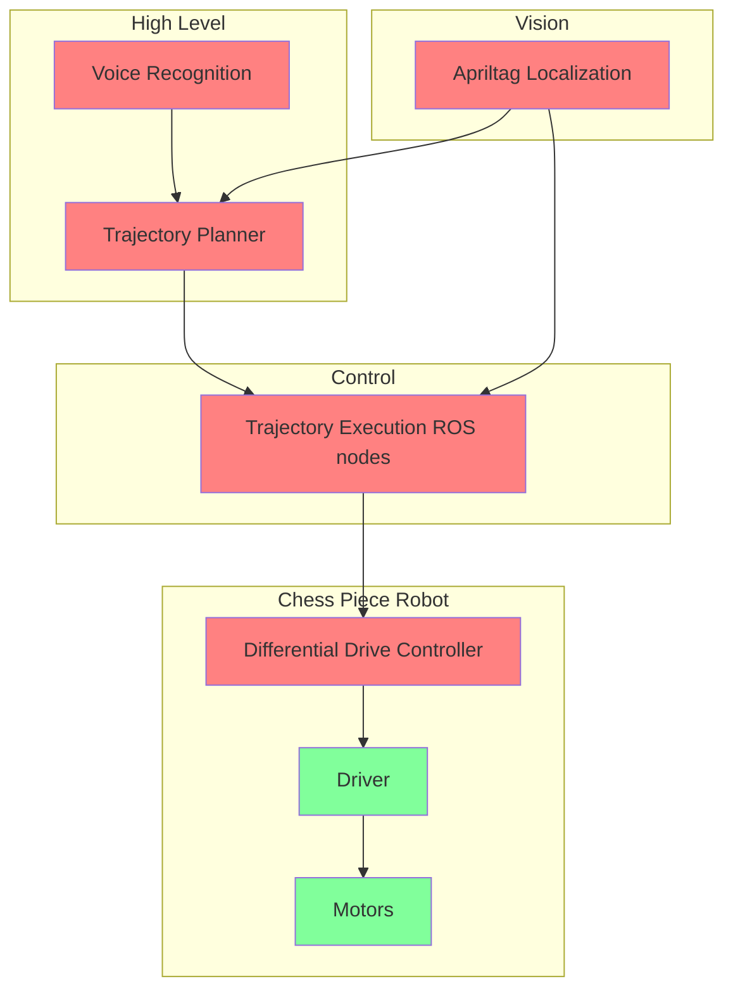

## System Overview

## High Level

### Voice Recognition 

#### Problem 

Given a voice command such as "Knight to e4", generate a machine readable command that can be inputted to the Trajectory Planner.

#### Potential Approach 

Can use python-based speech recognition libraries to output raw text, which can easily be converted to a [ROS message]() that is consumed by the Trajectory Planner

#### Related

- [ROS](https://wiki.purduearc.com/wiki/wizards-chess/software#ros)
- [Python](https://wiki.purduearc.com/wiki/wizards-chess/software#python)
- [SpeechRecognition Python Library](https://github.com/Uberi/speech_recognition)

### Trajectory Planner

#### Problem 

Given that we have just a camera which can localize (know the position of) each chess piece and find the center of any empty board square, how do we describe the movement of a chess piece from one square to another to complete a move using information we can actually execute on the robot, while not creating a collision with another piece?

#### Potential Approach 

Since our input to the system is in pixels, we can: 

1. Query the x,y position of where the piece starts and ends
2. Create a time-dependent, x,y-coordinate-valued trajectory between the two x,y positions (could be as simple as a straight line)
3. If the above trajectory results in a collision (can be determined using the distance formula between pieces and knowing the radius of each piece), create a trajectory for the other piece to move out of the way. (Take a look at flocking algorithms, linked below)
4. Now that we have a set of trajectories, send them to the trajectory execution node of each respective chess piece to be executed concurrently 

#### Related
- [ROS](https://wiki.purduearc.com/wiki/wizards-chess/software#ros)
- [Python](https://wiki.purduearc.com/wiki/wizards-chess/software#python)
- [OpenCV](https://wiki.purduearc.com/wiki/wizards-chess/software#opencv)
- [Flocking Algorithm](https://codeheir.com/2021/03/27/the-flocking-algorithm/)

## Vision

### Apriltag Localization

#### Problem 

How can we determine the position of each chess piece and every empty square on the board?

#### Potential Approach 

Apriltags are a simple way to solve this accurately. With just an Apriltag on the four corners of the board (still need to measure square size manually) and an Apriltag on each chess piece, we can determine the xyz position of the entire system.

#### Related

- [ROS](https://wiki.purduearc.com/wiki/wizards-chess/software#ros)
- [Apriltag ROS library](https://github.com/AprilRobotics/apriltag_ros)
- [Apriltag website](https://april.eecs.umich.edu/software/apriltag.html)

## Control 

### Trajectory Execution Controller Nodes

#### Problem 

How do we ensure that the robot is correctly executing the trajectory given by the Trajectory Planner, and if it is inaccurate, how do we control for it? 

#### Potential Approach 

Fortunately, we can look at control theory to give us a good solution: an LQR controller. This essentially is an optimization algorithm with weighted costs that the algorithm minimizes.

Also, a Pure Pursuit algorithm may be used as well.

For any algorithm, the inputs are the trajectory itself, the current localized position of the chess piece, the target position, and the output is a [Twist](http://docs.ros.org/en/api/geometry_msgs/html/msg/Twist.html) ROS message velocity command (the linear and angular velocity of the robot).

This would be running on the master computer that has access to camera input and the will be communicated to each robot as there will be a trajectory execution node for each robot.

#### Related

- [ROS](https://wiki.purduearc.com/wiki/wizards-chess/software#ros)
- [Python](https://wiki.purduearc.com/wiki/wizards-chess/software#python)
- [C++](https://wiki.purduearc.com/wiki/wizards-chess/software#c++)
- [LQR Controller](https://sophistt.github.io/2020/05/02/lqr-controller-theory/)
- [Pure Pursuit Algorithm](https://vinesmsuic.github.io/2020/09/29/robotics-purepersuit/#theoretical-derivation)

## Robot

### Differential Drive Controller

#### Problem 

The robot motors don't understand what Twist linear/angular velocity is, just the speed and direction at which they need to spin. So how do we convert the Twist to individual motor speeds (just a value between 0-255)? 

#### Potential Approach 

For different types of steering geometries, there are different control algorithms used to steer mobile vehicles (Skid-steer, Ackermann, differential drive, etc). 

For our robot, it is a differential drive steering configuration, specific to the geometry of two wheels on either side and a caster wheel for stability.

This would be running on the robot.

#### Related

- [ROS](https://wiki.purduearc.com/wiki/wizards-chess/software#ros)
- [Python](https://wiki.purduearc.com/wiki/wizards-chess/software#python)
- [Arduino/C++](https://wiki.purduearc.com/wiki/wizards-chess/software#c++)
- [Differential Drive Controller ROS Package](http://wiki.ros.org/diff_drive_controller)
- [Differential Drive Robots lecture - recommended for understanding theory](https://www.youtube.com/watch?v=aE7RQNhwnPQ&list=PLp8ijpvp8iCvFDYdcXqqYU5Ibl_aOqwjr&index=10)

## Problems not described yet
- Structuring the robot-level systems so they are modular and can easily spawned for all the chess pieces. 
- Ensuring that the system is controlled (i.e cameras can see all apriltags at all times, etc)
- Playing against an engine
- Simplifying the interface with a human (app?, website?)

# Resources

## Tools

### ROS  

- [ARC ROS tutorials (Recommended)](https://wiki.purduearc.com/wiki/tutorials/snake-tutorial)
- [Official ROS tutorials](http://wiki.ros.org/ROS/Tutorials)

### GitHub
- [Learn Git under 10 min](https://www.freecodecamp.org/news/learn-the-basics-of-git-in-under-10-minutes-da548267cc91/)

### C++
- [In depth tutorial playlist for C++](https://www.youtube.com/watch?v=18c3MTX0PK0&list=PLlrATfBNZ98dudnM48yfGUldqGD0S4FFb) 
  - Recommended:
    - if/else, loops, functions, classes
    - Pointers/References
    - Smart pointers
    - Dynamic Arrays (std::vector) 
- Very useful numeric libraries
  - [Eigen](https://eigen.tuxfamily.org/index.php?title=Main_Page): Extremely efficient matrix math library

### Python
- [Tutorial](https://www.youtube.com/watch?v=rfscVS0vtbw)
- Important to understand: 
  - Basics are good - variables + logic, functions, classes

### Numpy
> Must use when working with large arrays (i.e images)

- [Tutorial](https://www.youtube.com/watch?v=8Y0qQEh7dJg) 
- Important to understand: 
  - Creating arrays
  - slicing + indexing
  - reshaping
  - linear algebra

## OpenCV
> Use for computer vision and image transformations like color detection, tracking, etc

- [Tutorial](https://www.youtube.com/watch?v=oXlwWbU8l2o) 
- Important to understand: 
  - image transformation
  - thresholding
  - read/write images from file
  - resizing
  - tracking